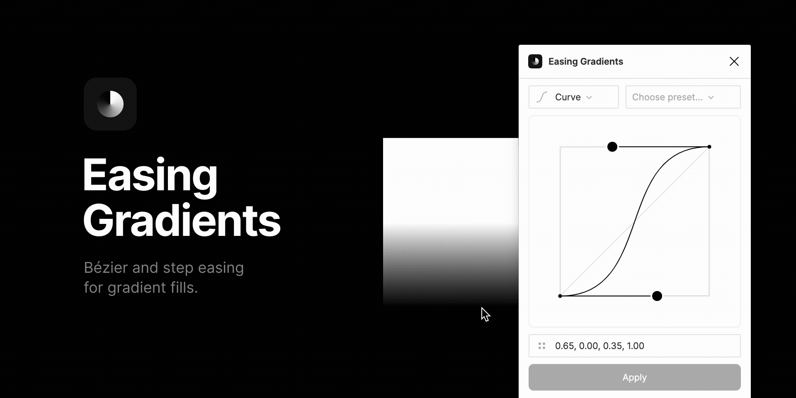

Allows easing of gradient fills in Figma using custom cubic-bézier or step easing functions.

## Refactor

This is a refactor of the original version of the plugin. Besides a frontend change from Vue to Preact, the plugin has other user-facing changes and QoL updates in its version 2.0.0:

-   Eased gradients can now be previewed directly in the canvas
-   It's now possible to save easing functions as presets
-   Improved feedback after user actions

#### Caveat with in-canvas preview

The in-canvas preview works by cloning the selected node and updating the cloned node's gradients on the fly. This comes with the caveat that the cloned node will enter the document's history and possibly pollute it. Even if the user closes the plugin without applying any easing function, CMD+Z'ing will restore the cloned node. However, when testing this feature it turned out that the benefit of a in-canvas easing preview outweighs the nuisance of this caveat.

## ✨ Usage

1. Go to _Plugins > Easing Gradients_
1. Select a shape with at least one gradient fill 🎨
1. Use one of the easing function presets or drag the control handles for custom easing 🖐️
1. Apply easing ✨

The plugin is 'gradient-agnostic' in that sense that it doesn't care about the type (linear, radial etc.) and orientation of the gradient. It takes the first and last color stop as parameters and will ease the gradient with the given easing function value. One caveat with this is that all other color steps in between are discarded.

## 🚧 Development

1. `npm i` — Install dependencies
1. `npm run watch` — Bundle the plugin and watch for changes 👁️

## 💭 Motivation

[Matan Kushner's](https://github.com/matchai) [existing Figma plugin](https://www.figma.com/community/plugin/781591244449826498) does a great job but lacks an user interface and customizable easing functions. I took this as an opportunity to extend the plugin with a set of features.

I'm grateful for [Andreas Larsen](https://github.com/larsenwork) for putting out his work on [easing gradients](https://larsenwork.com/easing-gradients/) and [Matan Kushner](https://github.com/matchai) for creating the [easing-gradient plugin](https://github.com/matchai/figma-easing-gradient) — his project was a great guidance how to initially tackle this project.

## 🌀 Misc

This plugin uses the amazing [create-figma-plugin](https://github.com/yuanqing/create-figma-plugin) library.

## 📝 License

[MIT](LICENSE)
