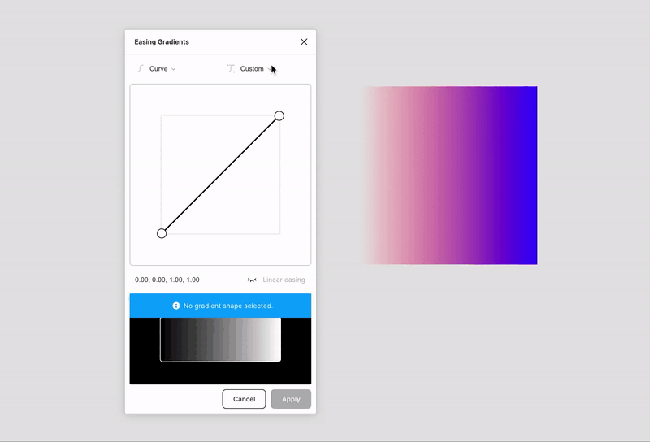

Allows easing of gradient fills in Figma using custom cubic-bézier or step easing functions.

This plugin is based on the great [work of Andreas Larsen](https://larsenwork.com/easing-gradients/) and should be seen as a fork of Andreas' [Sketch plugin](https://github.com/larsenwork/sketch-easing-gradient).

## ✨ Usage

1. Go to _Plugins > Easing Gradients_
1. Select a shape with atleast one gradient fill 🎨
1. Use one of the easing function presets or drag the control handles for custom easing 🖐️
1. Apply easing ✨

The plugin is 'gradient-agnostic' in that sense that it doesn't care about the type (linear, radial etc.) and orientation of the gradient. It takes the first and last color stop as parameters and will ease the gradient with the given easing function value. One caveat with this is that all other color steps in between are discarded.

#### Shape with multiple gradient fills

If a shape contains multiple gradient fills the same easing function will be applied to all gradient fill layers.

#### Multiple shapes selected

If multiple shapes are selected the same easing will be applied to all selected shapes (if they have a gradient fill layer).

## 🚧 Development

1. `npm install` — Install dependencies
1. `npm run watch` — Serve the plugin (just serves the frontend) 🔧
1. `npm run build` — Bundle the plugin for production using Vue-CLI 🚀

## 💭 Motivation

Coming from an industrial design background with a lot of surface modeling I was always intrigued with [surface curvatures](https://knowledge.autodesk.com/support/alias-products/learn-explore/caas/CloudHelp/cloudhelp/2014/ENU/Alias/files/GUID-9DD73E22-A5EF-4952-BB84-2CEE2109993C-htm.html). After discovering Andreas Larsen's great writeup on [gradient easing](https://css-tricks.com/easing-linear-gradients/) it really resonated with me and I thought about implementing it as a Figma plugin.

The [existing Figma plugin](https://www.figma.com/community/plugin/781591244449826498) by Matan Kushner does a great job but lacks an interface and custom easings. Instead of forking the project I decided to build it from 'scratch' to dive a little deeper into the Figma API and get a little more practice in TypeScript.

Wrapping this up I'm grateful for Andreas Larsen for putting out his work on [easing gradients](https://larsenwork.com/easing-gradients/) and Matan Kushner for creating the [easing-gradient Figma plugin](https://github.com/matchai/figma-easing-gradient); his project was great guidance how to tackle this project.

## 🌀 Misc

This plugin uses the [figma-plugin-ds-vue](https://github.com/alexwidua/figma-plugin-ds-vue) library.

## 📝 License

[MIT](LICENSE)
